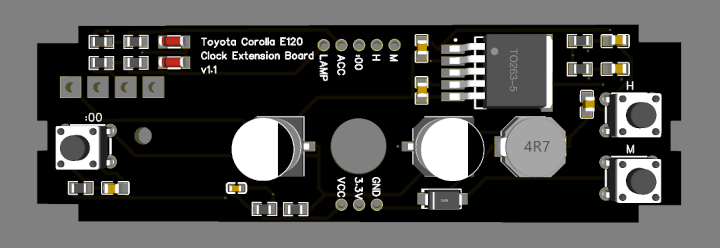

<h1 align=center>Toyota Corolla AMOLED Clock</h1>

Custom clock project using the LilyGo T-Display-S3 AMOLED

    

### Features
- Display the time on a high resolution AMOLED display
- Different colour/brightness based on interior lighting state (on/off)
- Colour Settings (digit colour, background opacity, whiteness level)
- Size Settings (width, thickness, padding)
- Automatic display timeout when accessory is off

### Dependencies
- **ESP-IDF** <= v4.4.6
- **Arduino-ESP32** <= v2.0.14 *(Place inside components folder)*
- **TFT-eSPI** <= v2.5.31 *(Place inside components folder)*
- **Required Libraries** (See [Official ESP-IDF Installation Steps](https://docs.espressif.com/projects/esp-idf/en/latest/esp32/get-started/linux-macos-setup.html))
    - Additionally: `python3-virtualenv`

### Configuration
- **menuconfig** *(Type "menuconfig" in Command Palette)*
    - Set all `TFT_eSPI` driver configuration pins to 0 (we are using `rm67162.h` and `rm67162.cpp` for driving the display)
    - `"Autostart Arduino setup and loop on boot"` should be enabled
- **CMakeLists.txt**
    - Make sure `main.cpp` and `rm67162.cpp` are both in `SRCS` entry for `idf_component_register`
    - `INCLUDE_DIRS` should be set to `"."` (Relative path of `main` directory, includes the header files)
- **VSCode (ESP-IDF)**
    - Set device to `esp32s3`
    - Set flash method to `UART`

### Step-by-Step DIY Tutorial
> This project requires a clock with 3 buttons (Asia/Pacific Model). If your clock does not meet this specification, you will need to purchase a separate clock housing. 
> A Linux-based OS is necessary to flash the software. **Debian Desktop or Ubuntu** are recommended.

1. **Procure T-Display-S3 AMOLED and Necessary Materials**
    - **T-Display-S3 Amoled** (https://www.lilygo.cc/products/t-display-s3-amoled)
    - Wire cutters
    - Soldering iron
    - Solder
    - Heat-resistant cables (compatible with 2.54mm spaced pins)

2. **Order PCB via JLCPCB Service**
    - Register an account at https://jlcpcb.com/
    - Navigate to https://cart.jlcpcb.com/quote/Upload and upload the gerber file located in `/docs/schematics`
    - Select "PCB Assembly"
    - Proceed with the checkout process, providing the files located in `docs/schematics`.

3. **Order 3D Print via JLC3DP Service**
    - Log in using the same account
    - Repeat the following process for both models:
        - Navigate to https://jlc3dp.com/3d-printing-quote and upload the STL file located in `/docs/models`
        - Choose a material that can withstand high temperatures
        - Add to cart and proceed with the checkout process

4. **Software Flashing**
    - Download Visual Studio Code from https://code.visualstudio.com
    - Install the dependencies as specified in the README
    - Follow the configuration steps as specified in the README
        - Clone the project: `git clone https://github.com/Cxmrykk/Corolla-Clock.git`
        - Navigate to the project directory: `cd Corolla-Clock`
        - Open with VSCode: `code .`
    - Connect the T-Display-S3 AMOLED board via USB-C and click the "Flash" button at the bottom

5. **Soldering Process**
    - Trim the wires on both sides (approximately 0.5cm) and tin them using the soldering iron
    - Solder wires to the T-Display-S3 AMOLED pins as follows:
        - GPIO 42: LAMP
        - GPIO 43: ACCESSORY
        - GPIO 44: RESET
        - GPIO 45: HOUR
        - GPIO 46: MINUTE
        - VBUS: VCC
        - 3.3V: 3.3V
        - GND: GND
    - After soldering, trim the ends to prevent contact (trim the top of the board, not the cables)
    - Solder the other ends of the cables to the PCB (refer to the pin map above)
    - Verify that all pins are soldered and none are touching

6. **Clock Removal and Assembly**
    - Remove the clock by following a tutorial on YouTube
    - Disassemble the clock by following a tutorial on YouTube (Exercise caution as the clock housing clips are brittle)
    - Remove the existing buttons and circuit board
    - Secure the new PCB to the clock housing using the existing screw
    - Insert the 3D printed mount and buttons (some force may be required for proper insertion)
    - Insert the Screen and PCB:
        - The USB-C port should be on the right side. The LILYGO logo should be upright (same orientation as clock housing)
        - Insert the screen first, then clip in the rest of the housing (with the PCB attached)
    - Finally, reinstall the clock and reassemble your car.

7. **Adjusting Alignment and Time**
    - Press the reset button (`:00`) to toggle the mode overlay
    - Press the hour button twice (`H`) to cycle to the vertical positioning menu
    - Press the reset button once more and hold the `H` and `M` buttons to adjust the screen position
    - Adjust the screen position as needed for clear text readability
    - Configure your clock as required (Set time, align screen, colours, sizing, brightness, etc)
